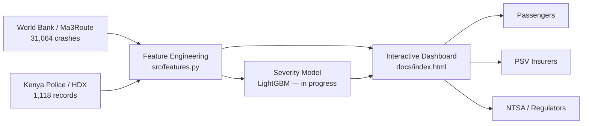

# BEBA SALAMA
### Kenya Road Risk Intelligence Platform

**Travel safely. Know before you go.**


A capstone project for the [Ngao Labs](https://ngaolabs.org) Foundations of Data Science & AI Bootcamp, delivered in partnership with DataCamp.

---

## The Problem

Kenya loses an estimated **3,000+ lives a year** to road traffic accidents, with an annual socioeconomic cost estimated in the hundreds of billions of shillings. Public transport — matatus and boda bodas — is disproportionately involved. Despite this, no accessible tool exists today that tells a passenger, an insurer, or a regulator which routes, times, and modes of travel carry the highest risk.

**Beba Salama** closes that gap: an interactive risk intelligence platform built from eleven years of real Kenyan crash data.

---

## Live Demo

The dashboard is published via GitHub Pages once enabled on this repo (`Settings → Pages → Source: /docs on main`):

**`https://3Fr4nj35-3ku5h3.github.io/beba-salama/`**

> 📸 *Add a screenshot of the live dashboard to `docs/screenshots/` and reference it here once deployed.*

---

## At a Glance

| Metric | Value |
|---|---|
| Crash records analysed | **31,064** (2012–2023) |
| Fatal incidents flagged | **2,284** (7.4%) |
| Matatu-involved crashes | **2,541** (8.2%) |
| High-severity incidents | **5,206** (16.8%) |
| Night vs. day fatality rate | **11.0% vs. 6.9%** (+60%) |
| Deadliest hour (by severity) | **05:00** |
| Years of coverage | **11** (Aug 2012 – Jul 2023) |

---

## Key Findings

1. **5am is the deadliest hour — not midnight.** Long-distance trucks, overnight matatus, and early boda bodas converge on empty roads with exhausted drivers.
2. **A night crash is 60% more likely to be fatal** than a day crash (11.0% vs 6.9%).
3. **Sunday carries the highest fatality rate; Friday carries the highest volume** — two distinct risk profiles requiring different interventions.
4. **Matatus appear in 8.2% of all recorded crashes**, and given passenger capacity, each incident risks multiple victims.
5. **Crash volume peaked in 2015 and has declined since** — evidence that interventions have measurable effect, though the problem remains acute.
6. **16.8% of crashes are classifiable as high-severity** using inputs (time, location, vehicle type) known *before* the journey begins — the core premise this platform is built on.

Full detail and interactive charts for each finding are in the live dashboard.

---

## Architecture



---

## Data Sources

**Layer 1 — World Bank / Ma3Route Kenya Road Traffic Crashes 2012–2023**
Geolocated crashes derived from crowdsourced Ma3Route reports (Twitter). 31,064 records with timestamp, GPS coordinates, fatality/pedestrian/matatu/motorcycle flags, and report volume.
Source: [microdata.worldbank.org/index.php/catalog/6249](https://microdata.worldbank.org/index.php/catalog/6249)

> **Required citation** (per World Bank DDI documentation):
> Milusheva S, Marty R, Bedoya G, Williams S, Resor E, et al. (2021) "Applying machine learning and geolocation techniques to social media data (Twitter) to develop a resource for urban planning." *PLOS ONE* 16(2): e0244317. https://doi.org/10.1371/journal.pone.0244317

**Layer 2 — Kenya Police / Humanitarian Data Exchange (HDX) Road Accidents Database**
1,118 police-recorded incidents (2016–2017) with road name, county, cause code, victim type, and demographic detail.
Source: [data.humdata.org/dataset/kenya-road-accidents-database](https://data.humdata.org/dataset/kenya-road-accidents-database)
⚠️ *License terms for this specific HDX resource were not confirmed at time of writing — verify on the dataset page before redistributing beyond this project.*

See [`data/README.md`](data/README.md) for the full data dictionary.

---

## Data Limitations & Ethical Considerations

Honesty here matters more than a clean pitch:

- **Crowdsourced bias.** Layer 1 depends on who tweets — better-connected, more urban, more English-literate reporters are over-represented. Rural and lower-income routes are likely under-counted, not lower-risk.
- **Partial year coverage.** Layer 2 covers April–June 2016 and Feb–Nov 2017 only — not full calendar years, so seasonal claims from that layer are directional, not definitive.
- **No ground-truth severity label.** "High risk" is an engineered composite (fatality/pedestrian/matatu/motorcycle flags + report volume), not an official severity classification — it should be presented as a model, not a fact.
- **Consequences of being wrong.** A route flagged "high risk" affects real operators' livelihoods and real passengers' decisions. Any production version needs a feedback loop, confidence intervals, and a clear owner for when predictions are wrong.
- **Who benefits.** A risk score is only useful to someone with a smartphone and data access — the platform should be judged on whether it reaches the pedestrians and boda riders who carry the highest risk, not just smartphone-owning matatu passengers.

---

## Tech Stack

- **Data & Modelling:** Python, pandas, scikit-learn, LightGBM, SHAP
- **Dashboard:** HTML/CSS/JS, Chart.js, Leaflet.js
- **Notebooks:** Jupyter
- **Hosting:** GitHub Pages (dashboard), Vercel (optional, for a future full app)

---

## Repository Structure

```
beba-salama/
├── data/
│   ├── raw/                  # Original World Bank + Kenya Police files (untouched)
│   └── processed/            # Cleaned, feature-engineered datasets
├── docs/
│   └── index.html            # Live interactive dashboard (GitHub Pages source)
├── notebooks/                # EDA and modelling notebooks
├── src/
│   ├── data_prep.py          # Loading, cleaning, road-name standardisation
│   └── features.py           # Severity scoring, time-based feature engineering
├── .github/
│   ├── ISSUE_TEMPLATE/
│   └── workflows/ci.yml      # Basic sanity-check CI
├── requirements.txt
├── LICENSE
└── README.md
```

---

## Getting Started

```bash
git clone https://github.com/3Fr4nj35-3ku5h3/beba-salama.git
cd beba-salama
python -m venv venv && source venv/bin/activate   # Windows: venv\Scripts\activate
pip install -r requirements.txt
```

To view the dashboard locally, open `docs/index.html` directly in a browser — no server required.

To work with the data:

```python
from src.data_prep import load_layer1, load_layer2
from src.features import engineer_features

df = load_layer1("data/raw/ma3route_crashes_algorithmcode.csv")
df = engineer_features(df)
```

---

## Roadmap

| Phase | Status |
|---|---|
| Data acquisition (Layer 1 + Layer 2) | ✅ Done |
| Exploratory data analysis | ✅ Done |
| Feature engineering (severity, time-based) | ✅ Done |
| Interactive dashboard (map, charts, risk checker) | ✅ Done |
| Road-name standardisation (Layer 2) | 🔄 In progress |
| LightGBM risk classification model | 🔄 In progress |
| SHAP explainability layer | ⬜ Planned |
| Business case document | ⬜ Planned |
| Ngao Labs capstone presentation | ⬜ Planned |

---

## Team

- **Francis Kuria** — Data engineering, feature pipeline, dashboard
- *[Teammate]* — *[role]*
- *[Teammate]* — *[role]*
- **Mentor:** *[name]*

*(Update this section with your team's names and roles.)*

---

## Contributing

See [`CONTRIBUTING.md`](CONTRIBUTING.md) for branch naming, commit conventions, and PR process for team members.

---

## License

Code in this repository is released under the [MIT License](LICENSE). Data usage is subject to the terms of the original sources (World Bank, Kenya Police / HDX) — see [`data/README.md`](data/README.md).

---

## Acknowledgments

- **Ngao Labs** and **DataCamp** — bootcamp delivery
- **World Bank Development Data Group** — Ma3Route crash geolocation dataset
- **Kenya Police Service / Humanitarian Data Exchange** — road accident records
- Our mentor, for guidance throughout the capstone
