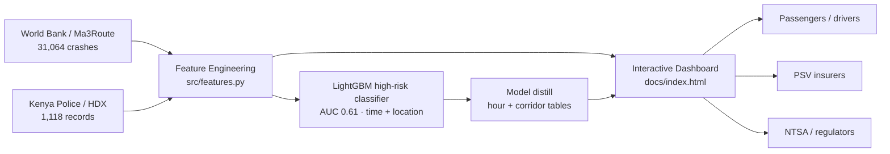

# 1. Title

# BEBA SALAMA
### Kenya Road Risk Intelligence Platform

**Travel safely. Know before you go.**

**Beba Salama: A Data-Driven Road Risk Intelligence Platform for Kenya**


A capstone project for the [Ngao Labs](https://ngaolabs.org) Foundations of Data Science & AI Bootcamp, delivered in partnership with DataCamp.

**Live demo:** https://3fr4nj35-3ku5h3.github.io/Beba-Salama/  
**Repository:** https://github.com/3Fr4nj35-3ku5h3/Beba-Salama

GitHub Pages serves `docs/index.html` from the `main` branch (`Settings → Pages → Source: Deploy from a branch → main → /docs`).

**On the live site:** historical crash map · 25 blackspot zones · analytics · Route Risk Check (LightGBM distill, AUC 0.61) · Drive Mode (GPS + Demo drive + mobile Exit)

---

## 2. Background Information

Road traffic crashes are a major public health and economic burden in Kenya. National estimates put annual road deaths in the order of **3,000+ lives**, with socioeconomic costs running into hundreds of billions of shillings. Public service vehicles — especially **matatus** and **boda bodas** — are frequently involved, and risk is not evenly spread across hours, days, or corridors.

Much of the available evidence is fragmented: police reports, hospital data, and crowdsourced transport feeds exist in separate systems. Passengers and drivers rarely have a simple way to see **which routes and times** have historically been more dangerous before they travel. Insurers and regulators similarly lack an accessible, transparent layer that turns historical crash patterns into actionable corridor- and time-level signals.

Between **August 2012 and July 2023**, the World Bank / Ma3Route programme produced a large geolocated dataset of Kenyan road crashes derived from crowdsourced reports. Combined with Kenya Police records published via the Humanitarian Data Exchange (HDX), this material makes it possible to study **when and where** high-severity incidents concentrate — and to build tools that surface that knowledge for everyday decisions.

**Beba Salama** ("travel safely") turns those data into:

1. An interactive **dashboard** (map, blackspot zones, analytics, findings)
2. An honest **machine learning classifier** for high-severity crash context (time and location only)
3. A **Route Risk Check** calibrated from that model
4. A **Drive Mode** with proximity alerts to computed blackspot zones (including a demo path for presentations)

### At a glance

| Metric | Value |
|---|---|
| Crash records analysed | **31,064** (2012–2023) |
| Fatal incidents flagged | **2,284** (7.4%) |
| Matatu-involved crashes | **2,541** (8.2%) |
| High-severity incidents | **5,206** (16.8%) |
| Night vs. day fatality rate | **11.0% vs. 6.9%** (+60%) |
| Deadliest hour (by severity) | **05:00** |
| Blackspot zones (DBSCAN) | **25** |
| Model AUC-ROC (held-out) | **0.61** (time + location only) |
| High-risk class recall | **~52%** at tuned threshold |
| Years of coverage | **11** (Aug 2012 – Jul 2023) |

### Key findings

1. **5am is the deadliest hour — not midnight.** Long-distance trucks, overnight matatus, and early boda bodas converge on empty roads with exhausted drivers.
2. **A night crash is 60% more likely to be fatal** than a day crash (11.0% vs 6.9%).
3. **Sunday carries the highest fatality rate; Friday carries the highest volume** — two distinct risk profiles.
4. **Matatus appear in 8.2% of all recorded crashes**, with multi-passenger consequences per incident.
5. **Crash volume peaked in 2015 and has declined since** — progress and crisis coexist.
6. **16.8% of crashes are classifiable as high-severity** using inputs knowable before a journey; the honest classifier reaches **AUC-ROC 0.61** on held-out data using only time and location.

---

## 3. Problem Statement

**Specific problem to be solved**

Kenyan road users, public-transport operators, and safety stakeholders lack an **accessible, evidence-based tool** that answers:

> *Given a corridor, time of day, and (optionally) mode of travel, what does eleven years of historical crash data imply about relative risk — and where are the geographic blackspots?*

Today that information is locked in research datasets, PDFs, and institutional systems. There is no single public product that:

- Visualises **31,000+** geolocated crashes and derived **blackspot zones**
- Explains **temporal patterns** (e.g. early-morning severity, night vs day fatality)
- Offers a **pre-journey risk estimate** grounded in a documented model, not marketing claims
- Can be **demonstrated live** (including without standing physically inside a Nairobi blackspot)

Without such a tool, passengers default to anecdote; enforcement and investment decisions risk being driven by incomplete or non-transparent signals.

---

## 4. Objectives

### 4.1 General objective

To design, build, and publish an interactive **Kenya road risk intelligence platform** that combines open crash data, transparent feature engineering, an honest supervised model, and a usable web product for exploration and pre-journey awareness.

### 4.2 Specific objectives

| # | Specific objective | Measurable / achievable target | Status |
|---|--------------------|--------------------------------|--------|
| 1 | Acquire and document Layer 1 (Ma3Route) and Layer 2 (Kenya Police / HDX) crash data | ≥30,000 Layer 1 records loaded; data dictionary and source links published | ✅ Achieved (31,064 Layer 1; 1,118 Layer 2) |
| 2 | Engineer a severity score and binary high-risk label with explicit formula | Formula documented; ~16.8% high-risk rate reported | ✅ Achieved |
| 3 | Train a high-risk classifier using **only pre-journey features** (time + location), after a formal leakage audit | Held-out **AUC-ROC** reported; leaky features excluded with proof | ✅ Achieved (**AUC 0.61**; leaky AUC ~0.81 rejected) |
| 4 | Compute spatial **blackspot zones** from crash coordinates | ≥20 zones with crash counts and risk ranking | ✅ Achieved (**25** DBSCAN zones) |
| 5 | Deliver a public interactive dashboard (map, charts, findings, method) | Live on GitHub Pages | ✅ Achieved |
| 6 | Link the Route Risk Check to a **model distill** (hour + corridor), with mode labelled as overlay only | UI copy and scores aligned with model philosophy | ✅ Achieved |
| 7 | Implement Drive Mode (GPS proximity + **Demo drive** + mobile-friendly Exit) | Demonstrable without real GPS in a blackspot | ✅ Achieved |
| 8 | Publish methodology, limitations, and ethical constraints on the product | Method + limitations on live site and this README | ✅ Achieved |

---

## 5. Datasets

### 5.1 Layer 1 — World Bank / Ma3Route Kenya Road Traffic Crashes (2012–2023)

| Item | Detail |
|------|--------|
| **Description** | Geolocated crashes derived from crowdsourced Ma3Route (Twitter) reports |
| **Size** | **31,064** records (algorithm-coded file used for modelling) |
| **Key fields** | Timestamp, latitude, longitude, number of reports, flags for fatality / pedestrian / matatu / motorcycle wording |
| **Publicly available** | Yes — World Bank Microdata Library |
| **Link** | https://microdata.worldbank.org/index.php/catalog/6249 |
| **Citation** | Milusheva S, Marty R, Bedoya G, Williams S, Resor E, et al. (2021). Applying machine learning and geolocation techniques to social media data (Twitter) to develop a resource for urban planning. *PLOS ONE* 16(2): e0244317. https://doi.org/10.1371/journal.pone.0244317 |

### 5.2 Layer 2 — Kenya Police / HDX Road Accidents Database (2016–2017)

| Item | Detail |
|------|--------|
| **Description** | Police-recorded incidents with road name, county, cause code, victim type, demographics |
| **Size** | **1,118** records (combined 2016 and 2017 sheets) |
| **Publicly available** | Yes — Humanitarian Data Exchange (HDX) |
| **Link** | https://data.humdata.org/dataset/kenya-road-accidents-database |
| **Notes** | Partial calendar coverage; road names inconsistent (standardisation ongoing). Confirm licence terms before redistribution beyond academic use. |

### 5.3 Derived data

- Time features: hour, day of week, month, night / rush-hour / weekend flags
- Composite **severity** and binary **high_risk**
- **25 blackspot zones** (DBSCAN on Layer 1 coordinates)
- Model artefacts: LightGBM booster, `results.json`, feature importance

See [`data/README.md`](data/README.md) for the full data dictionary.

### Data limitations & ethics

- **Crowdsourced bias** — urban, connected reporters over-represented; rural routes under-counted, not necessarily lower-risk
- **Partial Layer 2 coverage** — seasonal claims from police sheets alone are directional
- **Engineered severity** — not an official police severity class
- **Distill ≠ full booster in the browser** — Risk Check uses model-derived hour/corridor tables; mode is a labelled overlay
- **Consequences of error** — production use needs feedback loops and clear ownership
- **Accessibility** — phone-and-data tools do not automatically reach all high-risk road users

---

## 6. Methodology

### 6.1 Approach

1. **Data acquisition & cleaning** — Load Layer 1 CSV and Layer 2 Excel; parse dates (`src/data_prep.py`).
2. **Feature engineering** — Time windows and composite severity (`src/features.py`).
3. **Leakage audit** — Show that report counts and vehicle-text flags partly construct the target; remove them from inputs.
4. **Modelling** — LightGBM on safe features only; stratified split; class weight; threshold tuning (`src/train_model.py`, `notebooks/03_model_training.ipynb`).
5. **Spatial analysis** — DBSCAN blackspot zones for map and Drive Mode.
6. **Product** — `docs/index.html`: map, analytics, findings, method, Risk Check (model distill), Drive Mode (GPS + demo).
7. **Transparency** — Publish AUC, limits, and bias on the live Method section.

### 6.2 Severity label (target)

```text
severity = n_crash_reports×2 + fatality×5 + pedestrian×3 + matatu×2 + motorcycle×2
high_risk = 1 if severity ≥ 5 else 0   (~16.8% of crashes)
```

### 6.3 Safe model features (pre-journey only)

`hour`, `dow`, `month`, `is_night`, `is_rush_hour`, `is_weekend`, `latitude`, `longitude`

**Excluded (leakage):** `n_crash_reports`, matatu / motorcycle / fatality / pedestrian text flags.  
Proof: **1,456 / 1,456** crashes with ≥3 reports and all other flags zero were automatically high-risk by construction of the formula.

### 6.4 Evaluation

| Metric | Result |
|--------|--------|
| AUC-ROC (held-out) | **0.61** |
| High-risk recall | **~52%** |
| Leaky feature set (not shipped) | AUC ~**0.81** (rejected) |
| Dominant drivers | Location, then hour |

### 6.5 Architecture


```mermaid
flowchart LR
    A[World Bank / Ma3Route\n31,064 crashes] --> C[Feature Engineering\nsrc/features.py]
    B[Kenya Police / HDX\n1,118 records] --> C
    C --> D[LightGBM high-risk classifier\nAUC 0.61 · time + location]
    C --> E[Interactive Dashboard\ndocs/index.html]
    D --> F[Model distill\nhour + corridor tables]
    F --> E
    E --> G[Passengers / drivers]
    E --> H[PSV insurers]
    E --> I[NTSA / regulators]
```

### 6.6 Product surface

| Surface | Role |
|---------|------|
| Historical crash map | 31,064 incidents; filters for fatal, matatu, night, severity, density, blackspots |
| Blackspot zones | 25 DBSCAN zones; ranked risk for Drive Mode |
| Pattern analytics | Hour, day, heatmap, county, vehicle charts |
| Route Risk Check | Browser distill of LightGBM (corridor + hour); mode = vulnerability overlay only |
| Drive Mode | GPS proximity alerts; Demo drive; always-visible Exit on mobile; Esc on desktop |

### 6.7 Expected outcomes and real-life applicability

| Outcome | Applicability |
|---------|----------------|
| Public dashboard | Explore risk by map, hour, and corridor before boarding |
| Model-calibrated Risk Check | Relative pre-journey awareness — not a clinical or legal prediction |
| Blackspots + Drive Mode | Alerts near historically dense zones; demo path for training and presentations |
| Transparent metrics | Trust with mentors, insurers, and regulators; no inflated accuracy claims |
| Insurer / policy direction | Corridor signals as a possible underwriting or enforcement input (future) |

**Who this is for**

| Audience | Role |
|----------|------|
| Passengers & drivers | Free web tool: risk check + Drive Mode |
| PSV insurers | Corridor-level risk as underwriting signal (product direction) |
| NTSA / government | Evidence-based prioritisation of enforcement and infrastructure |

---

## 7. Tools and Technology Used

| Layer | Tools / libraries |
|-------|-------------------|
| **Language** | Python 3.10+ |
| **Data** | pandas, openpyxl |
| **ML** | scikit-learn, LightGBM, SHAP |
| **Notebooks** | Jupyter |
| **Dashboard** | HTML5, CSS3, JavaScript |
| **Charts** | Chart.js |
| **Maps** | Leaflet.js |
| **Browser APIs** | Geolocation, Vibration, Web Speech (Drive Mode) |
| **Hosting** | GitHub, GitHub Pages (`docs/` on `main`) |

### Repository structure

```
beba-salama/
├── data/
│   ├── raw/
│   └── processed/
├── docs/
│   └── index.html          # Live product (GitHub Pages)
├── models/
│   ├── lightgbm_high_risk.txt
│   ├── results.json
│   └── feature_importance.csv
├── notebooks/
│   └── 03_model_training.ipynb
├── src/
│   ├── data_prep.py
│   ├── features.py
│   ├── train_model.py
│   └── explain_model.py
├── requirements.txt
├── LICENSE
└── README.md
```

### Getting started

```bash
git clone https://github.com/3Fr4nj35-3ku5h3/Beba-Salama.git
cd Beba-Salama
python -m venv venv && source venv/bin/activate   # Windows: venv\Scripts\activate
pip install -r requirements.txt
```

- **Dashboard:** open `docs/index.html` in a browser (no server required).
- **Retrain:** `python src/train_model.py`
- **Data API:**

```python
from src.data_prep import load_layer1
from src.features import engineer_features

df = load_layer1("data/raw/ma3route_crashes_algorithmcode.csv")
df = engineer_features(df)
```

---

## 8. Timeline

*Indicative bootcamp schedule — adjust to your cohort calendar.*

| Phase | Activities | Indicative window | Status |
|-------|------------|-------------------|--------|
| **1. Scoping & data** | Problem definition; acquire Layer 1 & 2; data dictionary | Weeks 1–2 | ✅ Done |
| **2. EDA** | Temporal, spatial, vehicle patterns; key findings | Weeks 2–4 | ✅ Done |
| **3. Features & labels** | Severity formula; time features; processed tables | Weeks 4–5 | ✅ Done |
| **4. Modelling** | Leakage audit; LightGBM; evaluation; importance / SHAP | Weeks 5–7 | ✅ Done |
| **5. Spatial product** | DBSCAN blackspots; map integration | Weeks 7–8 | ✅ Done |
| **6. Dashboard** | Charts, findings, method, Risk Check, responsive UI | Weeks 6–9 | ✅ Done |
| **7. Drive Mode** | GPS alerts, Demo drive, mobile Exit, HUD behaviour | Weeks 9–10 | ✅ Done |
| **8. Integration** | Model distill → Risk Check; this README | Week 10 | ✅ Done |
| **9. Presentation** | Capstone demo, mentor feedback, final polish | Weeks 11–12 | ⬜ Planned |

### Roadmap (remaining)

| Item | Status |
|------|--------|
| Layer 2 road-name standardisation | 🔄 Ongoing |
| Optional live prediction API | ⬜ Future |
| Split data out of single HTML (performance) | ⬜ Future |
| Ngao Labs capstone presentation | ⬜ Planned |

---

## 9. References

### Data sources

1. World Bank Microdata Library. *Kenya road traffic crashes / Ma3Route-related geolocation products* (Catalog 6249).  
   https://microdata.worldbank.org/index.php/catalog/6249

2. Milusheva, S., Marty, R., Bedoya, G., Williams, S., Resor, E., et al. (2021). Applying machine learning and geolocation techniques to social media data (Twitter) to develop a resource for urban planning. *PLOS ONE*, 16(2), e0244317.  
   https://doi.org/10.1371/journal.pone.0244317

3. Humanitarian Data Exchange (HDX). *Kenya Road Accidents Database*.  
   https://data.humdata.org/dataset/kenya-road-accidents-database

### Project artefacts

4. Beba Salama live dashboard — https://3fr4nj35-3ku5h3.github.io/Beba-Salama/

5. Source repository — https://github.com/3Fr4nj35-3ku5h3/Beba-Salama

6. `notebooks/03_model_training.ipynb` — leakage audit, training, evaluation

7. `src/train_model.py`, `src/features.py`, `src/data_prep.py`

### Institutional context

8. Ngao Labs — Foundations of Data Science & AI Bootcamp (with DataCamp).  
   https://ngaolabs.org

---

## Team

- **Francis Kuria** — Data engineering, feature pipeline, modelling, dashboard
- *[Teammate]* — *[role]*
- **Mentor:** *[name]*

*(Update names and roles for your cohort.)*

---

## License

Code is released under the [MIT License](LICENSE). Data use follows World Bank and Kenya Police / HDX terms — see [`data/README.md`](data/README.md).

---

## Acknowledgments

- **Ngao Labs** and **DataCamp** — bootcamp delivery
- **World Bank Development Data Group** — Ma3Route geolocation dataset
- **Kenya Police Service / Humanitarian Data Exchange** — road accident records
- Mentors and peers who reviewed the leakage decision and product framing
