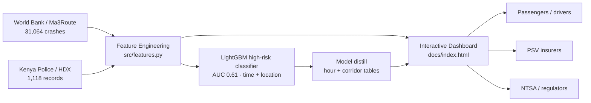

# BEBA SALAMA
### Kenya Road Risk Intelligence Platform

**Travel safely. Know before you go.**


A capstone project for the [Ngao Labs](https://ngaolabs.org) Foundations of Data Science & AI Bootcamp, delivered in partnership with DataCamp.

---

## Live Demo

**https://3fr4nj35-3ku5h3.github.io/Beba-Salama/**

GitHub Pages serves `docs/index.html` from the `main` branch (`Settings → Pages → Source: Deploy from a branch → main → /docs`).

**Try on the live site:**
- **Map** — 31,064 geolocated crashes + density / blackspot filters  
- **Blackspots** — 25 DBSCAN zones ranked by composite risk  
- **Analytics** — hour, day, county, vehicle, and severity charts  
- **Risk Check** — route × hour scores calibrated from the trained LightGBM model (AUC 0.61)  
- **Drive Mode** — GPS proximity alerts, or **▶ Demo drive** for presentations without Nairobi location  

---

## The Problem

Kenya loses an estimated **3,000+ lives a year** to road traffic accidents, with an annual socioeconomic cost estimated in the hundreds of billions of shillings. Public transport — matatus and boda bodas — is disproportionately involved. Despite this, no accessible tool exists today that tells a passenger, an insurer, or a regulator which routes, times, and modes of travel carry the highest risk.

**Beba Salama** closes that gap: an interactive risk intelligence platform built from eleven years of real Kenyan crash data — with a live dashboard, an honest classifier, and a Drive Mode that can be demonstrated without standing in a blackspot.

---

## At a Glance

| Metric | Value |
|---|---|
| Crash records analysed | **31,064** (2012–2023) |
| Fatal incidents flagged | **2,284** (7.4%) |
| Matatu-involved crashes | **2,541** (8.2%) |
| High-severity incidents | **5,206** (16.8%) |
| Night vs. day fatality rate | **11.0% vs. 6.9%** (+60%) |
| Deadliest hour (by severity) | **05:00** |
| Blackspot zones (DBSCAN) | **25** |
| Model AUC-ROC (held-out) | **0.61** (time + location only) |
| High-risk class recall | **~52%** at tuned threshold |
| Years of coverage | **11** (Aug 2012 – Jul 2023) |

---

## Key Findings

1. **5am is the deadliest hour — not midnight.** Long-distance trucks, overnight matatus, and early boda bodas converge on empty roads with exhausted drivers.
2. **A night crash is 60% more likely to be fatal** than a day crash (11.0% vs 6.9%).
3. **Sunday carries the highest fatality rate; Friday carries the highest volume** — two distinct risk profiles requiring different interventions.
4. **Matatus appear in 8.2% of all recorded crashes**, and given passenger capacity, each incident risks multiple victims.
5. **Crash volume peaked in 2015 and has declined since** — evidence that interventions have measurable effect, though the problem remains acute.
6. **16.8% of crashes are classifiable as high-severity** using inputs known *before* the journey begins — the core premise of the risk product. The honest classifier reaches **AUC-ROC 0.61** on held-out data using only time and location.

Full detail and interactive charts are on the live dashboard.

---

## Product Surface

| Surface | What it does |
|---|---|
| **Historical crash map** | Leaflet map of 31,064 incidents; filters for fatal, matatu, night, high severity, density, blackspots only |
| **Blackspot zones** | 25 zones from DBSCAN (ε ≈ 300 m, min 8 crashes); crash counts, fatality rates, peak hours |
| **Pattern analytics** | Timeline, hourly severity, day-of-week, heatmap, county, vehicle involvement (Chart.js) |
| **Route Risk Check** | Browser **distill** of LightGBM: corridor + hour probabilities; mode is a small labelled vulnerability overlay only |
| **Drive Mode** | `watchPosition` + haversine to zone centres; full-screen alert, vibration, speech; **Demo drive** simulates approach to Haile Selassie Junction; always-visible **Exit** for mobile (Esc still works on desktop) |

---

## Architecture


```mermaid
flowchart LR
    A[World Bank / Ma3Route\n31,064 crashes] --> C[Feature Engineering\nsrc/features.py]
    B[Kenya Police / HDX\n1,118 records] --> C
    C --> D[LightGBM high-risk classifier\nAUC 0.61 · time + location]
    C --> E[Interactive Dashboard\ndocs/index.html]
    D --> F[Model distill\nhour + corridor tables]
    F --> E
    E --> G[Passengers / drivers]
    E --> H[PSV insurers]
    E --> I[NTSA / regulators]
```

---

## Model (honest version)

**Target:** `high_risk` — engineered severity ≥ 5  
(`n_crash_reports×2 + fatality×5 + pedestrian×3 + matatu×2 + motorcycle×2`)

**Leakage audit (documented in `notebooks/03_model_training.ipynb`):**  
`n_crash_reports`, matatu/motorcycle text flags partly *define* the label. Proof: **1,456 / 1,456** crashes with ≥3 reports and all other flags zero were automatically high-risk. Including those features inflates AUC to ~**0.81**. They are **excluded** from the shipped model.

**Safe features (pre-journey only):**  
`hour`, `dow`, `month`, `is_night`, `is_rush_hour`, `is_weekend`, `latitude`, `longitude`

**Results (80/20 stratified hold-out):**

| Metric | Value |
|---|---|
| AUC-ROC | **0.61** |
| Recall (high-risk) | **~52%** |
| Train / test size | 24,851 / 6,213 |
| Importance | latitude, longitude, hour ≫ day flags |

Training: `src/train_model.py` → `models/lightgbm_high_risk.txt`, `models/results.json`, `models/feature_importance.csv`.

The **live Risk Check** does not run LightGBM in the browser. It uses a **distill** (hour and corridor probability tables from the trained model) plus a small mode overlay. That is stated on the dashboard Method section.

---

## Data Sources

**Layer 1 — World Bank / Ma3Route Kenya Road Traffic Crashes 2012–2023**  
Geolocated crashes from crowdsourced Ma3Route reports. 31,064 records with timestamp, GPS, fatality/pedestrian/matatu/motorcycle flags, and report volume.  
Source: [microdata.worldbank.org/index.php/catalog/6249](https://microdata.worldbank.org/index.php/catalog/6249)

> **Required citation** (per World Bank DDI documentation):  
> Milusheva S, Marty R, Bedoya G, Williams S, Resor E, et al. (2021) "Applying machine learning and geolocation techniques to social media data (Twitter) to develop a resource for urban planning." *PLOS ONE* 16(2): e0244317. https://doi.org/10.1371/journal.pone.0244317

**Layer 2 — Kenya Police / Humanitarian Data Exchange (HDX) Road Accidents Database**  
1,118 police-recorded incidents (2016–2017) with road name, county, cause code, victim type, and demographics.  
Source: [data.humdata.org/dataset/kenya-road-accidents-database](https://data.humdata.org/dataset/kenya-road-accidents-database)  
⚠️ License terms for this HDX resource should be re-checked before redistribution beyond academic use.

See [`data/README.md`](data/README.md) for the data dictionary.

---

## Data Limitations & Ethical Considerations

Honesty matters more than a clean pitch:

- **Crowdsourced bias.** Layer 1 depends on who reports — urban, connected users are over-represented. Rural routes are likely under-counted, not lower-risk.
- **Partial year coverage (Layer 2).** 2016 covers a few months; 2017 is incomplete — seasonal claims from that layer alone are directional.
- **Engineered severity, not official grade.** High-risk is a composite label, not a police severity class.
- **Distill ≠ full booster in the browser.** Risk scores follow the model’s time/place philosophy; mode is a product overlay only.
- **Consequences of being wrong.** Flagging a corridor affects operators and passengers. Production use needs feedback loops, uncertainty, and clear ownership.
- **Accessibility.** A phone-and-data tool does not automatically reach the pedestrians and boda riders who often carry the highest risk.

---

## Tech Stack

- **Data & modelling:** Python, pandas, scikit-learn, LightGBM, SHAP  
- **Dashboard:** HTML / CSS / JS, Chart.js, Leaflet.js (single-file product under `docs/`)  
- **Notebooks:** Jupyter (`notebooks/03_model_training.ipynb`)  
- **Hosting:** GitHub Pages (`docs/` on `main`)

---

## Repository Structure

```
beba-salama/
├── data/
│   ├── raw/                  # World Bank + Kenya Police sources
│   └── processed/            # Feature-engineered tables
├── docs/
│   └── index.html            # Live product (GitHub Pages)
├── models/
│   ├── lightgbm_high_risk.txt
│   ├── results.json
│   ├── feature_importance.csv
│   └── shap_importance.csv   # if generated
├── notebooks/
│   └── 03_model_training.ipynb
├── src/
│   ├── data_prep.py
│   ├── features.py
│   ├── train_model.py
│   └── explain_model.py
├── requirements.txt
├── LICENSE
└── README.md
```

---

## Getting Started

```bash
git clone https://github.com/3Fr4nj35-3ku5h3/Beba-Salama.git
cd Beba-Salama
python -m venv venv && source venv/bin/activate   # Windows: venv\Scripts\activate
pip install -r requirements.txt
```

**Dashboard locally:** open `docs/index.html` in a browser (no server required).

**Retrain the model:**

```bash
python src/train_model.py
```

**Work with data:**

```python
from src.data_prep import load_layer1, load_layer2
from src.features import engineer_features

df = load_layer1("data/raw/ma3route_crashes_algorithmcode.csv")
df = engineer_features(df)
```

---

## Roadmap

| Phase | Status |
|---|---|
| Data acquisition (Layer 1 + Layer 2) | ✅ Done |
| Exploratory data analysis | ✅ Done |
| Feature engineering (severity, time-based) | ✅ Done |
| Interactive dashboard (map, charts) | ✅ Done |
| Blackspot zones (DBSCAN) | ✅ Done |
| Drive Mode + Demo drive + mobile Exit | ✅ Done |
| LightGBM high-risk classifier | ✅ Done — AUC-ROC **0.61** |
| Data leakage audit | ✅ Done — leaky features removed |
| Risk Check linked to model distill | ✅ Done |
| SHAP / feature importance | ✅ Done |
| Road-name standardisation (Layer 2) | 🔄 Ongoing |
| Optional prediction API (live booster) | ⬜ Future |
| Split data out of single HTML for performance | ⬜ Future |
| Ngao Labs capstone presentation | ⬜ Planned |

---

## Who this is for

| Audience | Role |
|---|---|
| **Passengers & drivers** | Free web tool: check route risk, Drive Mode alerts |
| **PSV insurers** | Corridor-level risk as an underwriting signal (product direction) |
| **NTSA / government** | Evidence-based prioritisation of enforcement and infrastructure |

---

## Team

- **Francis Kuria** — Data engineering, feature pipeline, modelling, dashboard  
- *[Teammate]* — *[role]*  
- **Mentor:** *[name]*  

*(Update names and roles for your cohort.)*

---

## Contributing

See [`CONTRIBUTING.md`](CONTRIBUTING.md) for branch naming, commits, and PRs if working as a team.

---

## License

Code is under the [MIT License](LICENSE). Data use follows the original World Bank and Kenya Police / HDX terms — see [`data/README.md`](data/README.md).

---

## Acknowledgments

- **Ngao Labs** and **DataCamp** — bootcamp delivery  
- **World Bank Development Data Group** — Ma3Route geolocation dataset  
- **Kenya Police Service / Humanitarian Data Exchange** — road accident records  
- Mentors and cohort peers who reviewed the leakage decision and product framing  
